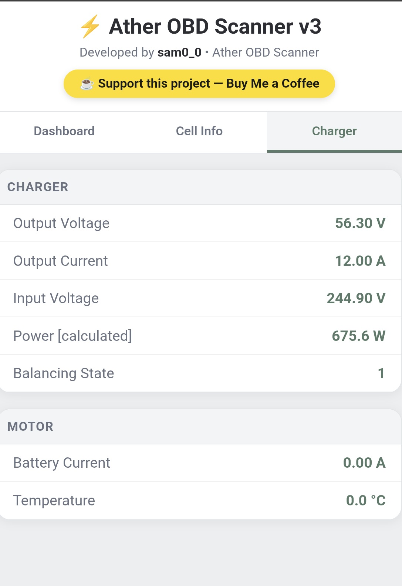
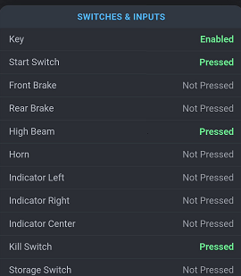
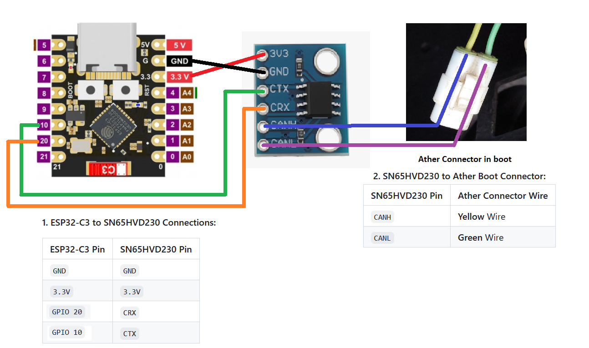
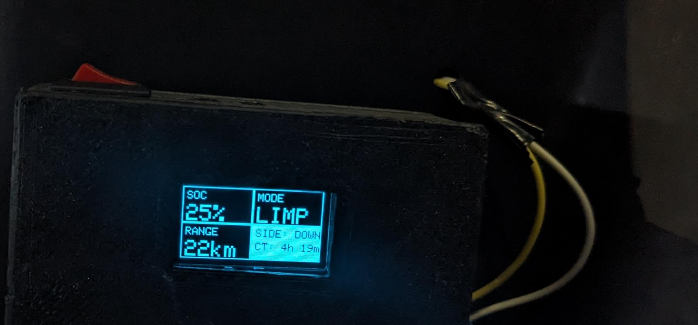
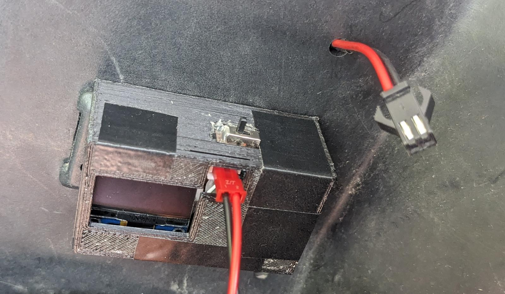

# Ather OBD & Diagnostic Reader

A passive, open-source OBD data reader for Ather electric scooters. This device reads real-time CAN bus data directly from the scooter's BMS (Battery Management System), allowing owners and technicians to monitor actual battery health, cell imbalance, switch statuses, and more. 

---

   

 <b> DEMO OF HOW IT LOOKS </b>

## ⚠️ Hardware Recommendations

You can build this using either an ESP32-WROOM or an ESP32-C3. **Please choose based on your usage:**

*   **ESP32-WROOM (Highly Recommended):** The best option for long-term use. It has adequate compute power, stays cool, and can be left connected to the scooter for months without any issues.
*   **ESP32-C3:** Only recommended for quick, limited usage (5-8 minutes at a time). Due to lower compute power, it tends to heat up quickly under this workload.

---

> **🛑 IMPORTANT NOTE (CURRENT RELEASE):** 
> The current `.bin` file, source code, and wiring diagram provided in this repository are **ONLY for the ESP32-C3**. 
> *The code and diagrams for the ESP32-WROOM are currently in development and will be added very soon!*
> 

## 🛠️ Hardware Requirements

You will need the following components to build the reader. Purchasing your components through the links below helps support this open-source project at **zero extra cost to you**:

* 1 × [ESP32-C3 SuperMini Development Board](https://www.flyrobo.in/esp32-c3-supermini-development-board-wifi-bluetooth-usb-c-soldered/?tracking=UwR6B669xp9SLKysVbq5gfq4L488E9TzDlFr8pJq41Ui1FcygUSdC9I0KRschPX2) *(ESP32-WROOM support coming soon)*
* 1 × [SN65HVD230 CAN Bus Transceiver Module Or You can get soldered version of it online as well ](https://www.flyrobo.in/wcmcu-230-can-bus-module-based-on-sn65hvd230/?tracking=UwR6B669xp9SLKysVbq5gfq4L488E9TzDlFr8pJq41Ui1FcygUSdC9I0KRschPX2)
* 4 × [Female-to-Female Jumper Wires](https://www.flyrobo.in/40pcs_10cm_female_to_female_jumper_cable_wire_for_arduino/?tracking=UwR6B669xp9SLKysVbq5gfq4L488E9TzDlFr8pJq41Ui1FcygUSdC9I0KRschPX2)
* 2 × [Female-to-Male Jumper Wires](https://www.flyrobo.in/10cm_male_to_female_jumper_cable_wire_for_arduino/?tracking=UwR6B669xp9SLKysVbq5gfq4L488E9TzDlFr8pJq41Ui1FcygUSdC9I0KRschPX2)

> 💡 **Support the Project:** The hardware links above are affiliate links. If you buy your parts using these links, a small referral commission goes directly into funding further research, hardware testing, and future firmware updates—without costing you a single extra rupee. Thank you for supporting open-source development!

---

## 💻 Software Requirements

*   **ESP Flasher Tool:**
    *   [Download for Windows (.zip)](https://github.com/Jason2866/ESP_Flasher/releases/download/v4.5.1/ESP-Flasher-Windows.zip)
    *   [Download for macOS / Linux](https://github.com/Jason2866/ESP_Flasher/releases)
*   The `.bin` firmware file (located in this repository).

---

## 🚀 Installation Guide

### Step 1: Flashing the ESP32-C3
1. Connect your ESP32 module to your PC/Laptop via USB.
2. Open the **ESP Flasher** application.
3. Select the correct COM/Serial port your ESP32 is connected to.
4. Select the `.bin` file provided in this folder and click **Flash**.
5. Wait a minute for the process to complete, then disconnect and reconnect the ESP32 to restart it.
6. Check the Wi-Fi networks on your phone or laptop. If you see a network named **`ather-obd`**, the flashing was successful! (If it doesn't appear, try flashing again).

### Step 2: Hardware Connections
*Make sure the ESP32-C3 is disconnected from power before wiring.*

Follow the wiring diagram below:

**1. ESP32-C3 to SN65HVD230 Connections:**

| ESP32-C3 Pin | SN65HVD230 Pin |
| :--- | :--- |
| `GND` | `GND` |
| `3.3V` | `3.3V` |
| `GPIO 10` | `CRX` |
| `GPIO 20` | `CTX` |

**2. SN65HVD230 to Ather Boot Connector:**

| SN65HVD230 Pin | Ather Connector Wire |
| :--- | :--- |
| `CANH` | **Yellow** Wire |
| `CANL` | **Green** Wire |

---

## 📊 Usage Instructions

1. Once all connections are securely made, power up the ESP32. You can use your PC or just a standard USB Power Bank (no PC required for regular use).
2. Connect your phone or laptop to the Wi-Fi network named: **ATHER-OBD`** and password for the wifi is **12345678**
3. After connecting To Wifi open your web browser and go to: [http://192.168.4.1](http://192.168.4.1)
4. You will now see your live dashboard displaying your scooter's real-time data!

---

## ✨ Features

*   **Actual State of Health (SOH):** See the true original SOH values straight from the Ather BMS, rather than relying on service center reports or app scorecards.
*   **Battery Imbalance Metrics:** Crucial for tracking individual cell health. If your imbalance is above `0.3`, it indicates excessive imbalance, and you may need to visit the service center for a warranty claim.
*   **Live Switch Diagnostics:** Check the real-time status of all buttons and switches on the scooter to isolate faulty hardware individually.
*   **Real-time Accuracy:** All data is pulled live directly from the BMS, ensuring 100% accuracy.
*   *More features in active development!*

---

## 💡 Use Cases

*   **Technicians & Proactive Owners:** Monitor genuine battery health to take timely action and fix/claim battery issues before it's too late.
*   **Broken Display Workaround:** Create a tiny secondary device for riders whose main displays are dead. They can view essential info (like battery SoC%) without paying for an expensive screen replacement. Ive made this device for personal use you can see the images !

   
*   **Base Variant Upgrades:** A lightweight external display for base variants (like the Ather Rizta without the Pro Pack) to view hidden metrics effortlessly. *(Note: Needs testing! Contact me if you own a Rizta and want to help test).*

---

---

## 🛒 Order a Plug-and-Play Device

If you don't want to deal with wiring, flashing, or soldering, I am building fully assembled, ready-to-use plug-and-play devices! 

Contact Me if you want to buy plug and play devices which works out of the box straight !

---

---

## 💖 Support This Project

Building open-source hardware, reverse-engineering CAN bus data, testing safely on actual vehicles, and maintaining the code takes a massive amount of time, effort, and late nights! 

If this tool helped you diagnose your scooter, saved you a trip to the service center, or if you just want to support the development of future updates (like adding full ESP32-WROOM support and new diagnostic features), **please consider supporting this project as well !** Your support is what keeps projects like this alive and free for the community. 

---

## 🛡️ FAQ & Safety Considerations

**Does it harm the vehicle or void my warranty?**  
**Absolutely not.** This device acts purely as a *passive reader*. It only listens to the incoming CAN data and does not transmit commands or make any changes to the scooter. Because you aren't splicing or cutting any wires, it is functionally identical to standard OBD-II scanners used in cars. It will not void your warranty.

**Is it safe to use?**  
**Yes.** Even if you accidentally plug the wires into the wrong pins on the Ather connector, it will not harm the scooter since the device only reads passive data. 

**Is there hidden code?**  
The project is entirely open-source. You are free to read the source code and compile/verify it yourself for total peace of mind.

## 📜 Policies & Privacy

1. **No Telemetry/Tracking:** This device and its code do not contain any telemetry, tracking software, or phone-home capabilities. Your scooter's data stays securely between your scooter and your phone.
2. **Disclaimer:** This is a community-driven, open-source project and is not affiliated with, endorsed by, or sponsored by Ather Energy. Use at your own discretion.

   ---

## ⚖️ License & Attribution

This project is licensed under the **Apache License 2.0**.

### 📢 Mandatory Attribution Notice
You are free to use, modify, study, or fork this project, provided you give appropriate credit to the original author:
* If you use this code, reverse-engineered CAN IDs, or diagrams in your own project, website, video, or research, you **must prominently link back to this repository**:
  > **Original Project:** [Ather OBD Diagnostic Reader by SAM0-0](https://github.com/SAM0-0/ATHER-OBD-READER)
* You may not claim the reverse-engineering work or firmware as your own original work.

---

## ⚠️ Disclaimers & User Responsibility

### 1. "Use at Your Own Risk"
* **User Responsibility:** This tool is an independent, community-driven diagnostic utility. You are solely responsible for how you handle your vehicle, your wiring, and any connections you make.
* **No Liability:** Under no circumstances shall the author, contributors, or maintainers be held liable for any direct, indirect, incidental, or consequential damages arising from the use or misuse of this project or its instructions.

### 2. Trademark Disclaimer
* *Ather*, *Ather 450X*, *Ather Rizta*, and associated brand names or logos are registered trademarks of **Ather Energy Limited**.
* This project is completely independent, non-official, and has **no affiliation, sponsorship, or endorsement** from Ather Energy Limited.
